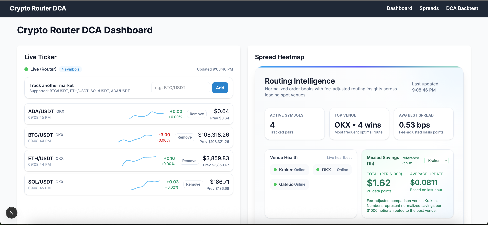

# Crypto Router DCA

A real-time cryptocurrency exchange routing and Dollar-Cost Averaging (DCA) strategy backtesting platform built with Next.js.

## 🚀 Features

- **Real-time Price Tracking**: Live cryptocurrency prices from multiple exchanges via WebSocket
- **Exchange Spread Analysis**: Compare bid-ask spreads across Bybit, Kraken, OKX, and Gate.io
- **Smart Routing**: Fee-adjusted price calculations to identify optimal trading venues
- **DCA Backtesting**: Portfolio performance visualization and strategy analysis
- **Missed Savings Calculator**: Quantify potential savings from optimal exchange routing

## 🛠 Tech Stack

- **Frontend**: Next.js 15, React 19, TypeScript
- **Styling**: Tailwind CSS
- **Data Visualization**: Recharts
- **Real-time Data**: WebSocket connections to Binance
- **State Management**: React Query (TanStack Query)

## 📸 Screenshot



*Dashboard showing real-time cryptocurrency prices, exchange spread analysis, and routing intelligence*

## 📊 Key Components

### Live Ticker
Real-time price feeds with sparkline charts and price change indicators for BTC, ETH, SOL, and ADA.

### Spread Heatmap
Multi-exchange price comparison with:
- Real-time bid/ask spreads
- Fee-adjusted effective prices
- Exchange status monitoring
- Missed savings calculations

### DCA Backtester
Portfolio performance analysis with:
- Equity curve visualization
- Performance metrics (Sharpe ratio, drawdown, volatility)
- Strategy comparison tools

## 🚀 Getting Started

```bash
# Install dependencies
pnpm install

# Start development server
pnpm dev
```

Open [http://localhost:3000](http://localhost:3000) to view the application.

## 📁 Project Structure

```
src/
├── app/                    # Next.js app router pages
│   ├── page.tsx           # Main dashboard
│   ├── spreads/           # Exchange spread analysis
│   └── backtest/dca/     # DCA backtesting
├── components/            # React components
│   ├── LiveTicker.tsx    # Real-time price display
│   ├── SpreadHeatmap.tsx # Multi-exchange comparison
│   └── EquityChart.tsx   # Portfolio visualization
├── lib/                   # Core business logic
│   ├── venues.ts         # Exchange venue management
│   ├── dca.ts           # DCA strategy calculations
│   └── coingecko.ts     # Price data utilities
└── app/api/              # API routes
    └── exchanges/        # Exchange data endpoints
```

## 🔧 Technical Highlights

- **WebSocket Integration**: Real-time price feeds with auto-reconnection
- **Error Handling**: Graceful fallbacks for API failures and geographic restrictions
- **Price Caching**: Persistent data during exchange outages
- **Fee Calculations**: Accurate trading cost analysis across venues
- **Responsive Design**: Mobile-first UI with Tailwind CSS

## 📈 Business Logic

The platform implements sophisticated exchange routing logic that:
- Calculates effective prices including trading fees
- Identifies optimal venues for each trading pair
- Tracks missed savings opportunities
- Provides real-time exchange status monitoring

## 🎯 Use Cases

- **Traders**: Find the best exchange for each trade
- **DCA Investors**: Backtest and optimize dollar-cost averaging strategies
- **Analysts**: Compare exchange performance and fee structures
- **Developers**: Learn real-time data integration and financial calculations

---